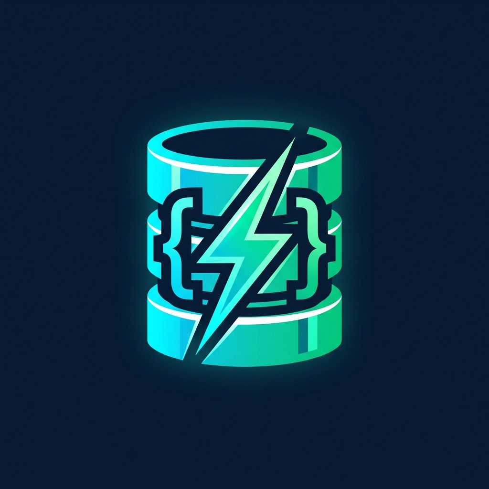
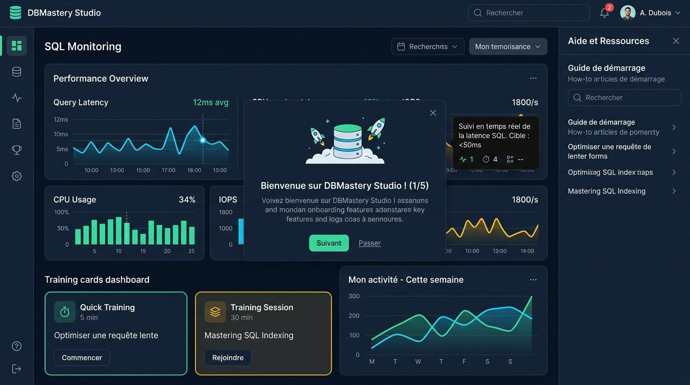
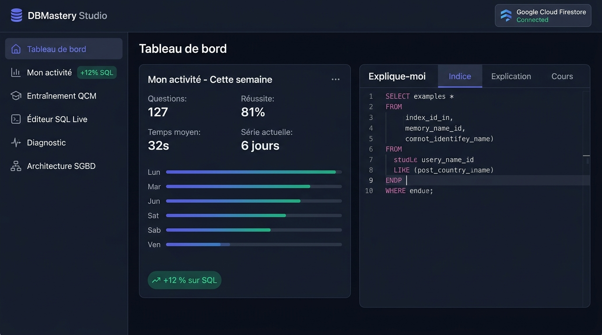

<div align="center">



# 🗄️ DBMastery Studio — SQL & Database Engineering Platform

**Plateforme interactive d'apprentissage, d'entraînement adaptatif et de certification SQL & Architecture SGBD**  
*Oracle Database SQL (1Z0-071) • PostgreSQL EDB • MySQL 8.0 DBA • Microsoft Azure SQL (DP-900 / DP-800)*

[](https://react.dev/)
[](https://www.typescriptlang.org/)
[](https://tailwindcss.com/)
[](https://firebase.google.com/)
[](https://github.com/AlaSQL/alasql)

</div>

---

## 📸 Captures d'Écran de l'Application

<div align="center">
  
  <p><em><strong>Vue 1</strong> : Guide d'Onboarding interactif en 6 étapes, tiroir d'Aide Contextuelle dynamique, Infobulles pédagogiques et Sessions Courtes (5 min & 30 min).</em></p>
</div>

<br />

<div align="center">
  
  <p><em><strong>Vue 2</strong> : Tableau de bord analytique, suivi « Mon activité — Cette semaine » (+12 % sur SQL), synchronisation Google Cloud Firestore et module « Explique-moi ».</em></p>
</div>

---

## 🧭 Table des Matières

- [🎨 Identité Visuelle & Logo Officiel](#-identité-visuelle--logo-officiel)
- [✨ Fonctionnalités Clés](#-fonctionnalités-clés)
  - [🎓 1. Onboarding Interactif, Aide Contextuelle & Infobulles](#-1-onboarding-interactif-aide-contextuelle--infobulles)
  - [⏱️ 2. Système de Sessions Courtes (5 min & 30 min)](#️-2-système-de-sessions-courtes-5-min--30-min)
  - [💡 3. Système Pédagogique « Explique-moi » (3 Niveaux)](#-3-système-pédagogique--explique-moi--3-niveaux)
  - [📊 4. Historique Personnel — Page « Mon activité »](#-4-historique-personnel--page--mon-activité-)
  - [☁️ 5. Authentification Google & Synchronisation Cloud Firestore](#️-5-authentification-google--synchronisation-cloud-firestore)
  - [⚡ 6. Laboratoire SQL Live & Skill Map 4D](#-6-laboratoire-sql-live--skill-map-4d)
- [🏗️ Architecture du Projet](#️-architecture-du-projet)
- [🛡️ Sécurité Firestore (Zero-Trust Rules)](#️-sécurité-firestore-zero-trust-rules)
- [🚀 Installation & Démarrage Rapide](#-installation--démarrage-rapide)
- [🛠️ Stack Technique](#️-stack-technique)

---

## 🎨 Identité Visuelle & Logo Officiel

L'application intègre un logo officiel vectoriel (`public/logo.svg` & composant `AppLogo.tsx`) ainsi qu'un emblème haute résolution :
- 🛢️ **Cylindres SGBD superposés** symbolisant l'architecture relationnelle et le stockage transactionnel.
- ⚡ **Éclair ambré & anneau émeraude** illustrant l'exécution SQL temps réel et les sessions d'entraînement rapides.
- 🔖 **Favicon SVG natif** déclaré dans `index.html` et affiché dans l'en-tête de la barre latérale, le guide d'Onboarding et le tiroir d'aide.

---

## ✨ Fonctionnalités Clés

### 🎓 1. Onboarding Interactif, Aide Contextuelle & Infobulles

Pour garantir une prise en main immédiate et accompagner l'apprenant sur chaque concept SQL, trois dispositifs d'assistance sont intégrés :

| Composant | Icône | Rôle & Fonctionnement | Accès |
| :--- | :---: | :--- | :--- |
| **Guide d'Onboarding** (`OnboardingModal`) | 🧭 | Parcours interactif en **6 étapes** au premier lancement : choix de la certification, test des sessions courtes (5/30 min), démo interactive du module *« Explique-moi »* et aperçu de *« Mon activité »*. | Automatique à la 1ère visite ou via le bouton **`Onboarding`** (barre supérieure / barre latérale). |
| **Aide Contextuelle** (`ContextualHelpDrawer`) | ❓ | Tiroir latéral intelligent dont le contenu **s'adapte dynamiquement à l'écran actif** : objectif de la vue, guide étape par étape et **Mémo SQL / Pièges d'examen** liés à l'écran consulté. | Bouton flottant **`? Aide contextuelle`** en bas à droite ou bouton **`Aide`** dans la barre supérieure. |
| **Infobulles Intelligentes** (`SmartTooltip`) | 💬 | Popovers haute lisibilité au survol ou au focus clavier sur les indicateurs, badges et paramètres de session (activables/désactivables en 1 clic depuis l'aide contextuelle). | Survol des métriques, boutons de navigation et cartes de sessions courtes. |

---

### ⏱️ 2. Système de Sessions Courtes (5 min & 30 min)

Deux formats d'entraînement quotidien sont accessibles en 1 clic depuis le **Tableau de bord**, la page **Mon activité**, la vue **Apprentissage & Quiz** et la **Barre latérale** :

```text
┌──────────────────────────────────────────┐   ┌──────────────────────────────────────────┐
│ « J'ai 5 minutes »                       │   │ « J'ai 30 minutes »                      │
│ ⚡ Quick Training                        │   │ 🎯 Training Session                      │
│                                          │   │                                          │
│ • 5 questions                            │   │ • 20 questions                           │
│ • 5 minutes                              │   │ • Difficulté progressive                 │
│ • Notions faibles uniquement             │   │ • Adaptée à mon niveau                   │
│                                          │   │                                          │
│ [ ▶ Commencer ]                          │   │ [ ▶ Commencer ]                          │
└──────────────────────────────────────────┘   └──────────────────────────────────────────┘
```

| Critère | ⚡ Quick Training (« J'ai 5 minutes ») | 🎯 Training Session (« J'ai 30 minutes ») |
| :--- | :--- | :--- |
| **Volume** | `5 questions` | `20 questions` |
| **Durée** | `5 minutes` (chronomètre `05:00`) | `30 minutes` (chronomètre `30:00`) |
| **Algorithme** | **Notions faibles uniquement** (`Subqueries`, `JOIN`, `Indexes`) | **Difficulté progressive** (`Q1–6 Fondamental` → `Q7–14 Intermédiaire` → `Q15–20 Avancé`) & **Adaptée à mon niveau** |
| **Bilan final** | Recalcul immédiat des scores de compétences + synchronisation avec *Mon activité* | Bilan complet par palier + recalcul des compétences + synchronisation Cloud |

---

### 💡 3. Système Pédagogique « Explique-moi » (3 Niveaux)

Pour éviter de donner immédiatement la réponse lors d'un blocage sur une question QCM ou un défi d'écriture SQL, chaque exercice intègre une barre d'assistance graduée :

```text
[ Réponse ]   [ 💡 Indice ]   [ 🧠 Expliquer ]   [ 👁️ Voir la solution ]
```

| Niveau | Badge | Objectif Pédagogique | Exemple de Contenu |
| :--- | :--- | :--- | :--- |
| **Niveau 1** | 💡 **Indice** | Orienter l'attention sans dévoiler la réponse | *« Regarde attentivement la condition du `JOIN` et le filtrage dans la clause `WHERE` vs `ON`. »* |
| **Niveau 2** | 🧠 **Explication** | Décomposer le mécanisme logique en jeu | *« Le `LEFT JOIN` conserve toutes les lignes de la table gauche, même sans correspondance à droite (colonnes à `NULL`)... »* |
| **Niveau 3** | 📖 **Cours** | Rappel théorique complet, syntaxe et cas limites | *Explication complète + requête d'exemple commentée + pièges classiques d'examen (`NULL` dans `NOT IN`, ordre d'exécution SQL).* |

---

### 📊 4. Historique Personnel — Page « Mon activité »

Une page dédiée **« Mon activité »** synthétise la régularité et la progression hebdomadaire en temps réel :

```text
Mon activité
Cette semaine

Questions          127
Réussite            81 %
Temps moyen         32 s
Série actuelle       6 jours

Progression

Lun     ███████
Mar     █████████
Mer     █████
Jeu     ██████████
Ven     ███████████

« Depuis la semaine dernière : +12 % sur SQL »
```

- 🔍 **Filtrage interactif par jour** : Cliquez sur n'importe quelle barre (`Lun` à `Ven`) pour inspecter le détail de la journée (nombre de questions, taux de réussite, vitesse moyenne et journal des tentatives).
- 📈 **Comparaison hebdomadaire par sous-domaine** : Décomposition de la progression sur `SELECT`, `WHERE`, `JOIN`, `GROUP BY / HAVING`, `Subqueries / CTE` et `Normalisation`.

---

### ☁️ 5. Authentification Google & Synchronisation Cloud Firestore

- 🔐 **Connexion Google en 1 clic** : Bouton **« Connexion Google »** visible dans la barre supérieure (`Header`), la barre latérale (`Sidebar`) et le bandeau d'état du Tableau de bord.
- 🔄 **Synchronisation Temps Réel (`onSnapshot`)** : Sauvegarde automatique du profil, des scores de compétences, des tentatives de questions et des pièges SQL identifiés.

---

### ⚡ 6. Laboratoire SQL Live & Skill Map 4D

- 🖥️ **Exécution SQL In-Browser (AlaSQL)** : Écrivez et exécutez de vraies requêtes SQL (`SELECT`, `INNER/LEFT/RIGHT JOIN`, `GROUP BY`, `HAVING`, `CTE WITH`) sur un schéma relationnel pré-chargé (`employees`, `departments`, `jobs`, `locations`).
- 🧭 **Skill Map Quadridimensionnelle** : Cartographie interactive sur 4 piliers (Syntaxe SQL, Modélisation & 3NF, Architecture Interne SGBD, Diagnostic & Optimisation).

---

## 🏗️ Architecture du Projet

```text
📦 dbmastery-studio
 ┣ 📂 public/
 ┃ ┗ 🎨 logo.svg                       # Logo vectoriel officiel & Favicon SVG
 ┣ 📂 src/
 ┃ ┣ 📂 assets/images/                 # Logo HD & Captures d'écran de l'application
 ┃ ┣ 📂 components/
 ┃ ┃ ┣ 🎨 AppLogo.tsx                  # Composant Logo officiel (variantes SVG & Image)
 ┃ ┃ ┣ 🧭 OnboardingModal.tsx          # Guide d'onboarding interactif en 6 étapes
 ┃ ┃ ┣ ❓ ContextualHelpDrawer.tsx     # Tiroir d'aide contextuelle dynamique par écran
 ┃ ┃ ┣ 💬 SmartTooltip.tsx             # Système d'infobulles pédagogiques accessibles
 ┃ ┃ ┣ ⚡ ShortSessionsWidget.tsx      # Cartes « J'ai 5 minutes » (5Q) & « J'ai 30 minutes » (20Q)
 ┃ ┃ ┣ 🎯 ShortSessionRunnerModal.tsx  # Exécuteur de sessions courtes avec chrono & bilan
 ┃ ┃ ┣ 💡 ProgressiveExplainPanel.tsx  # Module « Explique-moi » (💡 Indice, 🧠 Explication, 📖 Cours)
 ┃ ┃ ┣ 📊 PersonalActivityView.tsx     # Page « Mon activité » (Historique personnel & Progression)
 ┃ ┃ ┣ 📄 Header.tsx                   # Barre supérieure fixe + Connexion Google + Onboarding/Aide
 ┃ ┃ ┣ 📄 Sidebar.tsx                  # Navigation latérale + Logo + Accès rapide 5 min / 30 min
 ┃ ┃ ┣ 📄 DashboardView.tsx            # Tableau de bord analytique principal
 ┃ ┃ ┗ 📄 SqlLabView.tsx               # Éditeur SQL Live (AlaSQL) + Défis d'écriture SQL
 ┃ ┣ 📂 data/
 ┃ ┃ ┣ 📄 shortSessionsData.ts         # Catalogue calibré pour les sessions 5 min et 30 min
 ┃ ┃ ┗ 📄 mockData.ts                  # Banque de questions SQL/SGBD, défis SQL et cours
 ┃ ┣ 📂 services/
 ┃ ┃ ┣ 📄 statsService.ts              # Calcul des métriques, série (streak) et activité hebdomadaire
 ┃ ┃ ┣ 📄 competencyService.ts         # Recalcul dynamique des compétences SQL
 ┃ ┃ ┗ 📄 firebaseSyncService.ts       # Synchronisation temps réel Firestore & gestion d'erreurs
 ┃ ┣ 📄 firebase.ts                    # Initialisation Firebase SDK (Auth + Firestore)
 ┃ ┣ 📄 types.ts                       # Interfaces TypeScript globales
 ┃ ┗ 📄 App.tsx                        # Orchestrateur principal
 ┣ 📄 firebase-blueprint.json          # Schéma des entités et collections Firestore
 ┣ 📄 firestore.rules                  # Règles de sécurité Firestore Zero-Trust
 ┗ 📄 package.json                     # Dépendances et scripts NPM
```

---

## 🛡️ Sécurité Firestore (Zero-Trust Rules)

| Collection | Chemin Firestore | Règle d'Accès | Validation des Données |
| :--- | :--- | :--- | :--- |
| **Profil Utilisateur** | `/users/{userId}` | Propriétaire uniquement (`request.auth.uid == userId`) | Clés strictes (`hasOnly`), validation des types et bornes |
| **Tentatives QCM/SQL** | `/users/{userId}/attempts/{attemptId}` | Lecture/Écriture par propriétaire uniquement | Validation des durées (`timeSpent`), difficulté et horodatage |
| **Pièges SQL** | `/users/{userId}/traps/{trapId}` | Lecture/Écriture par propriétaire uniquement | Suivi de vulnérabilité et compteur d'occurrences |

---

## 🚀 Installation & Démarrage Rapide

```bash
# 1. Installer les dépendances
npm install

# 2. Démarrer le serveur de développement (port 3000)
npm run dev

# 3. Compiler pour la production
npm run build
```

---

## 🛠️ Stack Technique

- ⚛️ **Frontend** : React 19, TypeScript 5.8, Vite 6
- 🎨 **UI & Design** : Tailwind CSS 4, Lucide Icons, thèmes *Dark Obsidian Slate* & *High-Contrast Light*
- 🗄️ **Moteur SQL Embarqué** : AlaSQL (exécution SQL relationnelle en mémoire)
- 🔥 **Cloud & Auth** : Firebase Authentication (Google Sign-In) & Cloud Firestore
- 🌐 **Internationalisation** : Français 🇫🇷 / Anglais 🇬🇧 instantané

---

<div align="center">
  <sub>Conçu pour l'excellence technique en ingénierie des bases de données et la réussite aux certifications SQL.</sub>
</div>
